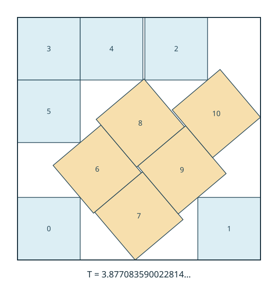

# Optimality of the eleven-square packing

**Revised geometric manuscript:** [Eleven squares: owners, support chains, and angle penalties](paper/README.md)
gives the marker-based reduction and an independent-angle support argument.
An early corridor and two virtual supports shorten the surviving case to a
103-node dependency graph. The excluded cases now include an elementary
terminal argument for case 0, a 12-point certificate for case 3, and a
65-point certificate for case 5. The paper includes direct proofs of the
geometric foundations and a self-contained verification supplement. See its verification
notes for the distinction between completed component checks and the portable
full replay.

This repository presents a computer-assisted certificate proof that the known
packing of **eleven congruent unit squares in a square is optimal**, allowing
arbitrary independent rotations and boundary contact.

The claimed exact minimum container side is

$$s_{11}=T=\frac{6u+4}{1+2u-u^2}=3.8770835900228141773078970601\ldots,$$

where $u$ is the unique real root in $(9/25,37/100)$ of

$$5u^8-10u^7-2u^6+14u^5+12u^4-6u^3+2u^2+2u-1=0.$$

**Read [PROOF.md](PROOF.md) for the complete argument and its trust assumptions.**
It explains the exact construction, continuous geometric exclusions, closed
boundary cases, symmetry reduction and local isolation at the algebraic endpoint.



*Rounded illustration of the attaining construction; the proof checks exact algebraic coordinates.*

## The argument

1. An exact construction attains $T$.
2. A closed center cover reduces every hypothetical smaller packing to one of
   2,184 canonical cell patterns.
3. Exact certificates exclude 2,180 patterns: 1,931 baseline cases, 76 extensions
   and 173 additional cases. The verifier checks the actual sets, not just counts.
4. An exact square-symmetry argument reduces the four remaining patterns to case 438.
5. A complete branch cover of case 438 either gives a geometric contradiction
   or forces the packing into a rigorously certified isolation neighborhood of
   the construction. It therefore cannot fit into any square of side below $T$.

This is a computational certificate argument with an explicit mathematical and
software trust base. It is not a completed Lean/formal proof, and publication
here does not constitute independent peer review. The source project records a
completed 23-stage verification. The privacy-normalized public copy has its own
validation scope, stated in [PUBLICATION.md](docs/PUBLICATION.md); no old run logs
are included or treated as a substitute for checking the certificates.

## Contents

| Path | Contents |
|---|---|
| [PROOF.md](PROOF.md) | Detailed mathematical exposition and checker obligations. |
| `src/evidence/` | Verification sources and mathematical supporting notes. |
| `src/discovery/` | Available research/search sources, including earlier approaches. |
| `data/` | Compressed, deduplicated certificate inputs and their content index. |
| [VERIFY.py](VERIFY.py) | One-command preparation and full verification driver. |
| [REPRODUCING.md](docs/REPRODUCING.md) | Setup, individual stages, requirements and limits. |
| [SOURCE_GUIDE.md](docs/SOURCE_GUIDE.md) | Where to begin reading the implementation. |
| [PUBLICATION.md](docs/PUBLICATION.md) | Privacy transformations and validation status. |
| [UPLOAD.md](docs/UPLOAD.md) | GitHub upload instructions, including Git LFS. |

Certificate inputs contain exact rational coordinates, angle intervals, branch
ancestry, algebraic data and dual weights. Mathematical audit receipts required
by the existing consumers are retained as structured inputs; the verifier must
recompute their premises. Console logs, conversation history, virtual
environments and private workstation addresses are excluded.

## Reproduce

After cloning with Git LFS and installing the dependencies:

```sh
python3 -m venv .venv
.venv/bin/python -m pip install -r requirements.txt
.venv/bin/python -B VERIFY.py
```

The final command runs every verification stage. Use Python without `-O`.
See [REPRODUCING.md](docs/REPRODUCING.md) for disk requirements and the distinction
between certificate verification and regenerating the discovery search.

## Attribution

The known packing is attributed to Walter Trump. The bundled exact construction
from `jlevy/squares` credits David Ellsworth's diagram; its pinned upstream
revision is `c55726e1e885227f63110131c0a914665175ff89`. The local isolation theorem
from that work is one component of the global argument, not itself a global
optimality theorem. See [THIRD_PARTY_NOTICES.md](THIRD_PARTY_NOTICES.md).
